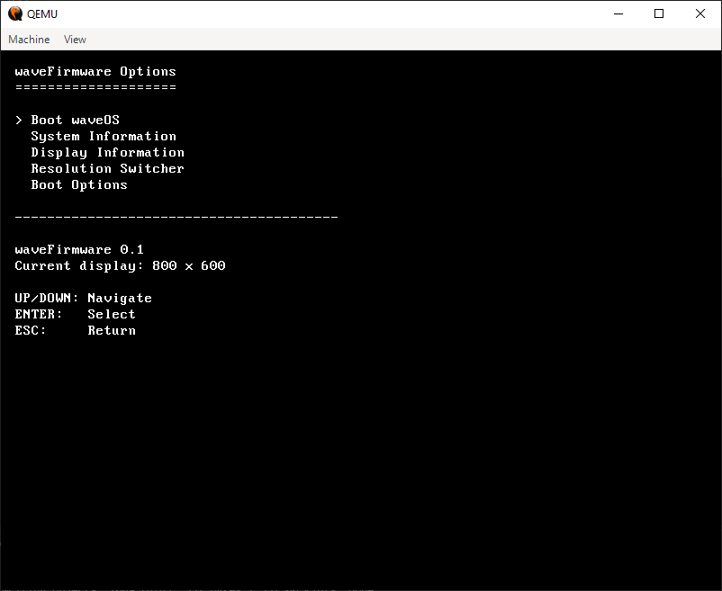

# waveOS

waveOS is a small experimental x86-64 operating system built from scratch.

It is not trying to replace Windows, Linux, or macOS. It is mostly an excuse to write low-level code and see how far it can go.

## Screenshots

## What It Has

### Bootloader

* UEFI boot support
* Custom waveOS bootloader
* Boot countdown
* Keyboard-controlled boot menu
* `waveFirmware Options`
* Display information
* System information
* Resolution switching
* Kernel loading
* Framebuffer setup

### Kernel

* x86-64 kernel
* Framebuffer graphics
* Basic text rendering
* Keyboard input
* Mouse input
* IDT
* PIC
* PIT
* PS/2 support
* Basic memory-related functionality
* Boot information from the bootloader

### Shell

waveOS includes a small command-line shell.

Current commands include:

* `help`
* `clear`
* `echo`
* `version`
* `pizza`
* `ls`
* `about`
* `uptime`

The shell is intentionally simple and is still being expanded.

### Filesystem

waveOS has basic FAT32 filesystem support.

It can work with files and directories and includes the beginnings of a custom file manager called **wFs Explorer**.

### Editor

waveOS has its own text editor.

It is designed to edit files directly inside the operating system rather than relying on an external editor.

## What It Doesn't Have

waveOS is still very much a work in progress.

It currently does not have:

* Networking
* Wi-Fi
* Bluetooth
* USB support
* Audio
* GPU acceleration
* 3D graphics
* Proper multitasking
* User accounts
* Permissions
* SMP
* Advanced power management
* A package manager
* A web browser
* Modern application compatibility
* Linux application compatibility
* Windows application compatibility
* A fancy desktop environment
* The ability to make coffee

The last one is especially unfortunate.

## Graphics

waveOS uses a framebuffer for its graphics.

The resolution can be selected through the bootloader, allowing waveOS to run at different display modes supported by the firmware.

1080p is, naturally, preferred when available.

## Development

waveOS is primarily developed for x86-64 systems.

The project is currently tested using:

* QEMU
* OVMF
* UEFI
* LLVM/Clang
* FAT32 disk images

Real hardware support is still limited.

## Why?

Because writing an operating system is a completely reasonable thing to do instead of sleeping.

waveOS exists mainly as a learning project and a way to experiment with:

* Kernel development
* Bootloaders
* UEFI
* Hardware interfaces
* Filesystems
* Graphics
* Input devices
* Low-level C programming

## Status

**Very much in development.**

Things will break.

Things will be rewritten.

Things will occasionally triple-fault.

This is normal.

## Future Plans

Possible future features include:

* Better filesystem support
* More shell commands
* Improved editor
* Better memory management
* Process management
* Multitasking
* More hardware support
* A graphical desktop
* More applications
* Better system utilities

## Disclaimer

waveOS is not currently intended to be used as a daily operating system.

It is a personal experimental project.

If it boots, that's a win.
